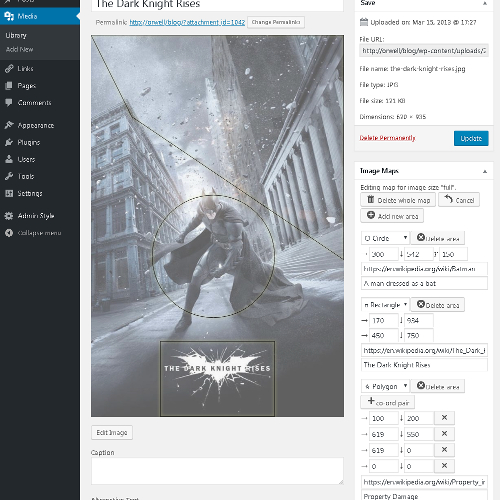
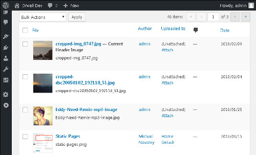

# Add Image Maps ###

Wordpress Plugin to implement HTML Image Maps for any image, including headers

```
Contributors: driannmcdonald
Tags: display, images, links, imagemaps
Requires at least: 3.0.1
Tested up to: 4.9.4
License: GPLv2
License URI: http://www.gnu.org/licenses/gpl-2.0.html
```

## Description

This plugin allows authors to turn areas of an image into links by implementing 
HTML image maps in Wordpress.

Authors can enter the co-ordinates of image areas on the editing page and see 
them outlined on the image. They will then appear in public.

The plugin allows for featured images and headers. Admins can configure where
the plugin looks for images with maps, and how it interacts with responsive
images.

## Installation 

1. Upload `add-img-maps.zip` to the `/wp-content/plugins/` directory
1. Unzip it.
1. Activate the plugin through the 'Plugins' menu in WordPress

## How to use



1. Choose the image you wish to edit in the library. 
1. Open it in the attachment edit page. (From "Attachment details", click on "Edit more details")
1. Click on "create image map for size 'full'"
1. Add clickable areas, including alt text as well as links. (This is not a full GUI, but the areas are visible on the image, which is slightly greyed out when
you edit the image maps.)
1. Click 'update' to save the image with the map.
1. Either:
  * Add the image to the desire page/post, and confirm it is "attached" (in the attachment edit screen or media list view), or
  * Make the image the page's featured images, or
  * Set the image as a header
  
## Configuration options

On the Admin settings page for the plugin, you can save CPU time by turning it off where you don't need it. You can also decide whether to turn off the responsive images feature for images with maps.

  ## Troubleshooting

### I've created an image map, and inserted the image into a page, but the image map isn't working.

Add_Img_Maps doesn't search the page HTML to find every image (which would slow the plugin down). Instead, it asks Wordpress which images are attached to it (or featured, or the header).

These are the things to check:

1. #### Did you add the Image Map to the right instance of the image?

When you add images to a theme, as a header or an icon, Wordpress sometimes creates a new cropped or shrunk image. Those copies do not appear in the media library grid screen, so they're easy to miss. They *are* listed in the Add_Img_Maps box on the attachment edit screen, with a link to *their* attachment edit screen.

2. #### Is the image attached to the post/page in the Wordpress database?

(Skip this if it's the featured image or the header, which are checked separately.)

The Add_Img_Maps box tells you which post/page (if any) the image is attached to. 

You can change which images are attached to which pages if, as an admin, you go to the Media Library and choose the list view.

> 
> ###### What does 'attached' mean?
> "Attached", in this context, doesn't quite mean exactly the same thing as appearing on the page. By default, the 
> images "attached" to the post are the ones uploaded whilst editing it,
> which is why they are listed as "uploaded to this page" in 
> the post edit screen. Depending which editor you use, you can easily end up putting an image on a post without 
> "attaching" it. And if you upload an image to a page, and then remove the image, it will still be "attached".

3. #### Does the site theme include the image ID in its markup?

Unfortunately, solving this involves writing something on the `Text` tab of the post editing screen.

Most themes, when the insert images into pages, include the image's Wordpress ID somewhere in the HTML. (The number on the edit screen address after `post =`). The most popular ways are as the value of an attribute called `data-attachment-id` or a series of CSS classes of the form `wp-image-1234`, ending in the id number.

If your theme doesn't have those, then Add_Img_Maps will try to recognise it by filename, but that's not guaranteed, and you might have to manually add one of those to the HTML. If you aren't familiar with the text tab, this is how to do it:

  1. Go to the image edit screen, and copy the image ID number from after `post=` in the web address
  2. Go to the page/post edit screen
  3. Go to the text tab, and find the start of the `<img ` tag.
  4. After `<img `, paste ` data-attachment-id="XXX" `, replacing XXX with the ID number 

## Screenshots TODO 

1. This screen shot description corresponds to screenshot-1.(png|jpg|jpeg|gif). Note that the screenshot is taken from
the /assets directory or the directory that contains the stable readme.txt (tags or trunk). Screenshots in the /assets
directory take precedence. For example, `/assets/screenshot-1.png` would win over `/tags/4.3/screenshot-1.png`
(or jpg, jpeg, gif).
2. This is the second screen shot

## Changelog 

### 1.0.0 

* Initial release.
* Incorporated Image Map Resize

### 0.1.0

* Initial Development

## Interaction with responsive images ##

HTML Image Maps don't play well with responsive images; their dimensions are absolute, and they don't scale up or down when CSS resizes the image. This is a problem with the image maps themselves. 

Wordpress 4.4 onwards includes srcset and sizes attributes to make all images
responsive. So this plugin takes a couple of steps to solve this, both of which
can be turned off or on in the plugin settings page.

Firstly, it optionally turns off the responsiveness for images with maps, by
deleting their srcset and sizes attributes.

Secondly, it incorporates David Bradshaw's __Image Map Resizer__ script to keep
image maps the same size as their images. This is useful not just for responsive
images, but for every image that is displayed in other than full size.

## Credits ##

[Image Map Resizer](https://github.com/davidjbradshaw/image-map-resizer) is 
&copy; David Bradshaw, and incorporated under an MIT Expat license.
